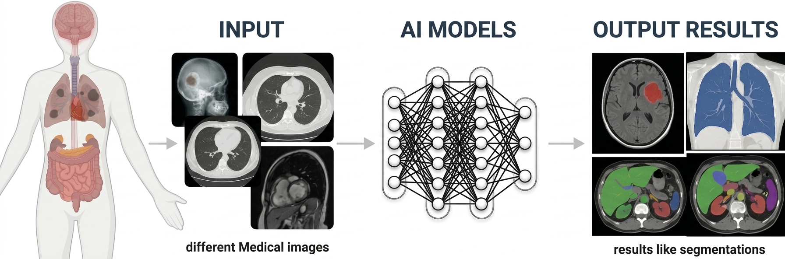
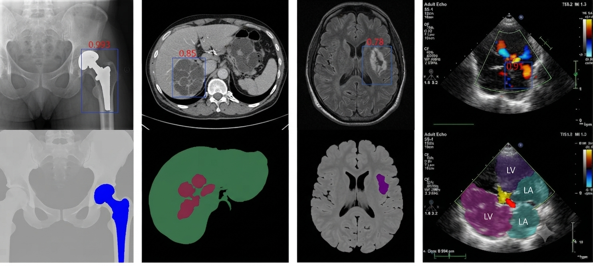

 
----

<!-- 
 -->

### Welcome to my GitHub profile!

I am a Graduate Researcher at University of Illinois Chicago with a passion for **computer vision**, **machine learning**, and **data science**.

I have hands-on experience with **deep learning and computer vision research**, coupled with strong foundations in programming and analytical tools.

In particular, I am interested in applying **AI to healthcare and technology challenges**.

As someone who is passionate about continuous learning and collaboration, I am actively seeking opportunities to contribute and grow within the field of data science and machine learning

### 🚀 Research Interests

* **Medical Image Segmentation**
* **Object Detection and Localization in Radiographs**
* **Multimodal Medical Imaging**
* **Computer-Aided Diagnosis (CAD) and AI Metrics** 

 

### 💼 Skills & Tools

- **Programming Languages**: Python, MATLAB, C++
- **Frameworks**: PyTorch, TensorFlow, OpenCV
- **Other Tools**: Git, Docker, LaTeX

### 🌱 Current Learning

I'm expanding my expertise in:
- Advanced **Computer Vision** techniques
- **Deep Learning** applications for medical image datasets
- **Multi-modal Data Fusion** and integration

### 🤝 Looking to collaborate on

- **Medical Image Analysis**
